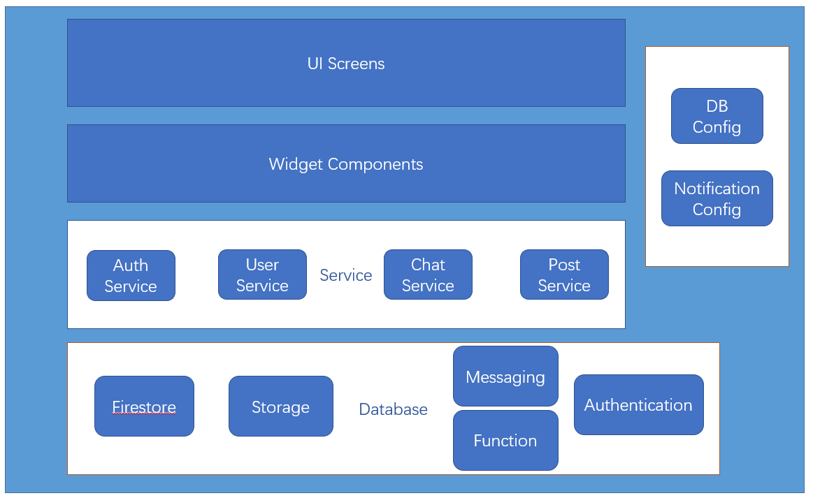

# Sale Garage Platform

## Author and Responsibility

Zhenyu Ye (001393004): In charge of the architecture design, database design, UI design, messaging service, location configuration, notification configuration, and module's integration.

Jialiu Cui (001393004): In charge of the database design, authentication, item posting service, user service, and UI design.

## Introduction

This is the final project of **Zhenyu Ye 001306083** & **Jialiu Cui ** for INFO6350 class 2020 spring. This is an app designed for users to quickly post, view items they want to buy or sell, and message each other on the items they are interested in just like a typical garage sale. We used flutter and firebase in this project.  

### Demo

https://drive.google.com/open?id=1OBLkWcgnGHiIKnxJS2cpRn0KJjoy7onA

## Architecture

## Feature
Users can sign in with a google account, post & view items, message other users, show their locations and view other's locations with this app.  
1. Posting  
Posting items users want to sell and viewing the posts of items users want to buy are the main functions of this app:
   - post pictures, price, descriptions of the item they want to sell
   - add multiple pictures to your post
   - view all the items post in My Garage
   - share your location if you choose to when posting
   - view other users' post
   - swipe between different pictures of a post
   - view other's locations if available  
2. Messaging  
Users can directly message each other in the app when they want to buy or sell:
   - tap the message icon on the post page to start a conversation
   - tap the message icon on homepage to continue conversations that users have started
   - send the interested item directly in the messaging screen
   - swipe to dismiss the discussed item if users choose to not send items in message
   - send pictures in the message
   - get notification of other users' messages when the app is running in the background  
3. Location    
Users can share their locations and view other locations in the app:
   - choose to show or not to show locations when posting
   - view others' locations directly in the app
   - tap google map icon to view locations in google map when more info or navigation is needed
